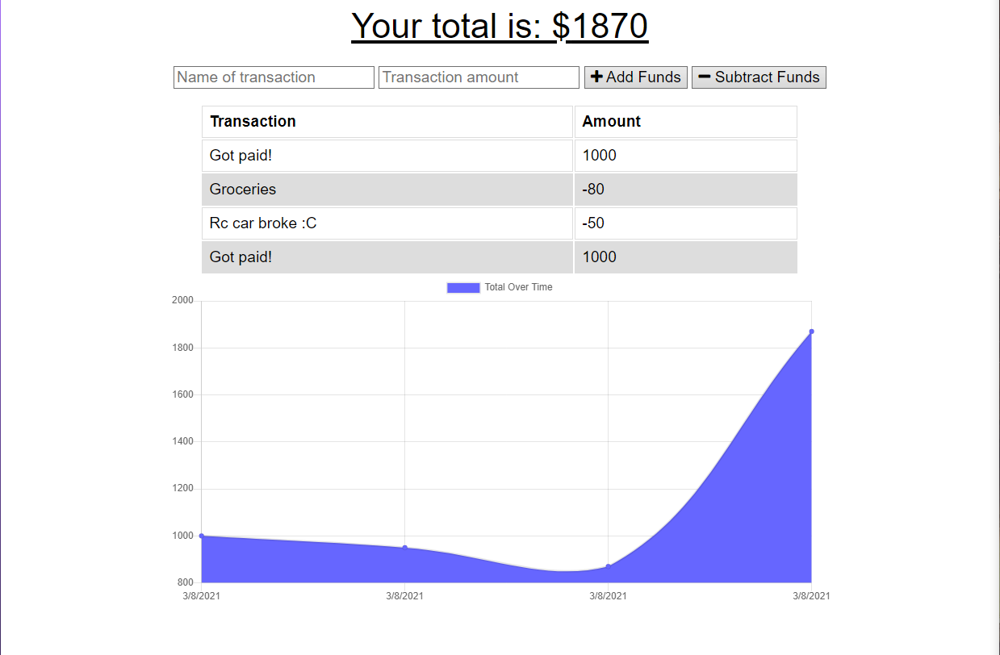

# Budget-Tracker

```
Link to live site: https://whispering-plains-75670.herokuapp.com
```

Budget Tracker is an app that allows the user to keep track of their spending and their income. The app use a mongo database for keeping track of the information.
There is also a service worker and data caching capabilities on this app, allowing the user to "use the app" offline. The user's changes are saved locally and when 
the user is back online, the changes they made get loaded into the app online.

